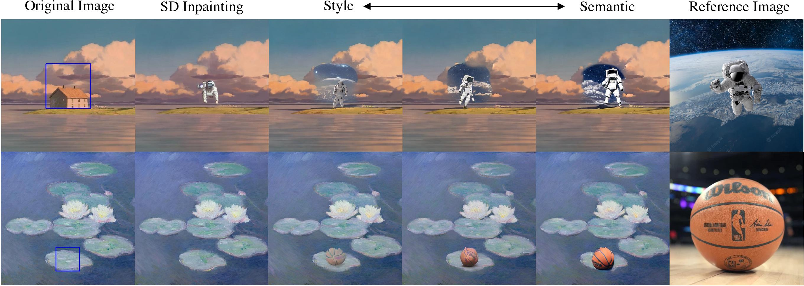
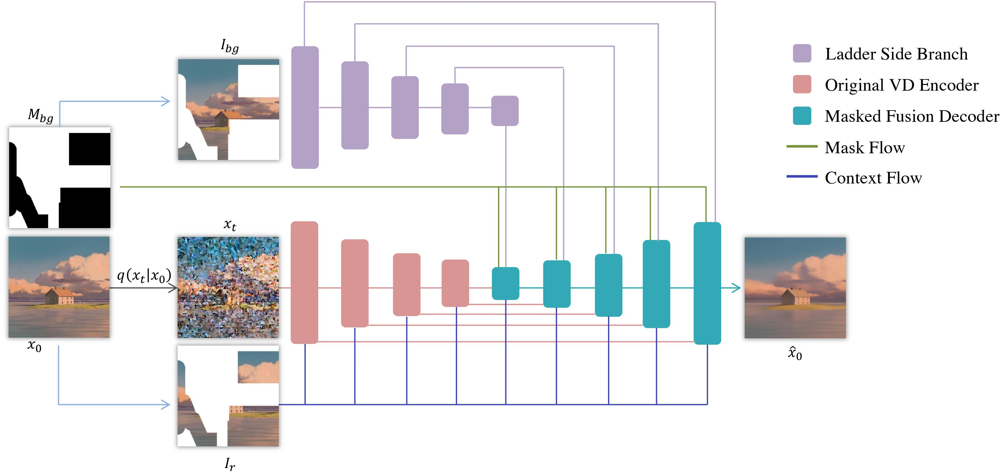

# Reference-based Painterly Inpainting via Diffusion: Crossing the Wild Reference Domain Gap

[](https://opensource.org/licenses/MIT)

The official implementation of paper "Reference-based Painterly Inpainting via Diffusion: Crossing the Wild Reference Domain Gap".

Dejia Xu, Xingqian Xu, Wenyan Cong, Humphrey Shi, Zhangyang (Atlas) Wang

[[Paper]](https://arxiv.org/abs/2307.10584) [[Website]](https://vita-group.github.io/RefPaint)

## Overview




## Citation

```
@article{xu2023refpaint,
    title={Reference-based Painterly Inpainting via Diffusion: Crossing the Wild Reference Domain Gap},
    author={},
    journal={arxiv preprint},
    year={2023}
}
```

